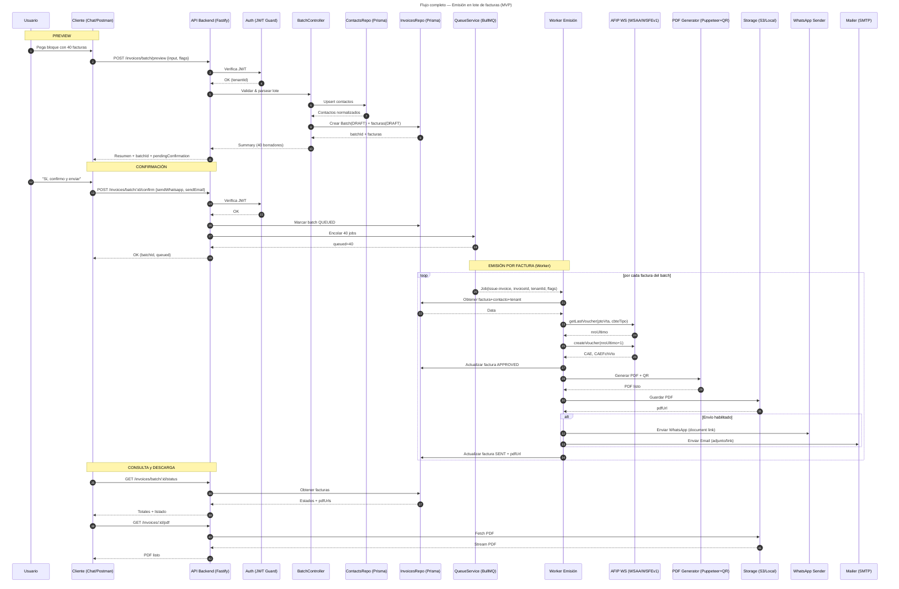

# Invoxia - MVP Facturador Multi-Tenant

Sistema de facturación electrónica multi-tenant para AFIP que permite emitir lotes (1|10|40|n) facturas en minutos con envío automático por WhatsApp y Email.

## 🚀 Características

- **Multi-tenant** con aislamiento completo de datos
- **Facturación por lotes** con preview y confirmación
- **Integración AFIP** (WSAA + WSFEv1)
- **Envío automático** de PDFs por WhatsApp y Email
- **Interfaz WhatsApp** para gestión de lotes
- **Generación de PDFs** con QR AFIP obligatorio

## 🛠️ Stack Técnico

- **Backend**: Fastify + TypeScript
- **Base de datos**: PostgreSQL + Prisma ORM
- **Colas**: BullMQ + Redis
- **PDF**: Puppeteer
- **Mensajería**: WhatsApp Business Cloud API + SMTP
- **AFIP**: @afipsdk/afip.js

## 🏗️ Desarrollo Local

### Requisitos Previos
- Node.js 22+
- Docker & Docker Compose
- Git

### Configuración Inicial

1. **Clonar e instalar dependencias**
```bash
git clone <repo-url>
cd backend
npm install
```

2. **Configurar variables de entorno**
```bash
cp .env.production .env
# Editar .env con tus credenciales
```

3. **Iniciar servicios (PostgreSQL + Redis)**
```bash
npm run services:start
```

4. **Ejecutar migraciones**
```bash
npm run db:migrate:dev
```

5. **Iniciar aplicación en desarrollo**
```bash
npm run dev
```

### 🚀 Flujo de Desarrollo Diario

#### Iniciar Desarrollo
```bash
# 1. Iniciar servicios de base de datos
npm run services:start

# 2. Ejecutar aplicación con hot-reload
npm run dev
```

#### Comandos de Servicios Docker
```bash
npm run services:start    # Iniciar PostgreSQL + Redis
npm run services:stop     # Detener servicios
npm run services:clean    # Detener y limpiar volúmenes
npm run services:logs     # Ver logs de servicios
npm run services:restart  # Reiniciar servicios
```

#### Comandos de Base de Datos
```bash
npm run db:generate       # Generar cliente Prisma
npm run db:migrate:dev    # Crear y aplicar migración
npm run db:push          # Sincronizar schema (desarrollo)
npm run db:studio        # Abrir Prisma Studio
```

#### Comandos de Desarrollo
```bash
npm run dev              # Desarrollo con hot-reload
npm run build           # Compilar TypeScript
npm run start           # Ejecutar versión compilada
npm run test            # Ejecutar tests
npm run test:watch      # Tests en modo watch
npm run lint            # Linter
npm run format          # Formatear código
```

### 🔗 Conexiones Locales

- **API**: http://localhost:3000
- **PostgreSQL**: localhost:<port>
  - Usuario: `<user>`
  - Password: `<password>`
  - Database: `<database>`
- **Redis**: localhost:<port>
- **Prisma Studio**: http://localhost:5555 (cuando esté ejecutándose)

### 🗃️ Herramientas Recomendadas

- **Base de Datos**: [Beekeeper Studio](https://www.beekeeperstudio.io/) para PostgreSQL
- **Redis**: `redis-cli -h localhost` o [RedisInsight](https://redis.com/redis-enterprise/redis-insight/)
- **API Testing**: Postman, Insomnia, o Thunder Client (VS Code)

## 🚀 Despliegue en Producción

### Railway Deployment

Este proyecto está configurado para desplegarse automáticamente en [Railway](https://railway.app/) usando Docker.

#### Configuración Inicial en Railway

1. **Conectar Repositorio**
   - Crear cuenta en Railway.app
   - Conectar repositorio de GitHub
   - Railway detectará automáticamente el `Dockerfile`

2. **Agregar Base de Datos PostgreSQL**
   ```bash
   # En el dashboard de Railway
   → Add Service → Database → PostgreSQL
   ```

3. **Variables de Entorno Requeridas**
   ```bash
   NODE_ENV=production
   DATABASE_URL=${PGDATABASE_URL}  # Auto-generada por Railway
   
   # Variables personalizadas (agregar manualmente)
   JWT_SECRET=<your-secure-jwt-secret>
   API_KEY=<your-api-key>
   AFIP_CERT_PATH=/app/certs/cert.crt
   AFIP_KEY_PATH=/app/certs/private.key
   WHATSAPP_API_TOKEN=<your-whatsapp-token>
   SMTP_HOST=<your-smtp-host>
   SMTP_USER=<your-smtp-email>
   SMTP_PASS=<your-smtp-password>
   ```

4. **Despliegue Automático**
   - Railway despliega automáticamente en cada `git push` a la rama principal
   - Utiliza el `Dockerfile` para crear la imagen de producción
   - Ejecuta migraciones automáticamente durante el despliegue

#### Comandos Post-Despliegue

```bash
# Ejecutar migraciones en producción (si es necesario)
railway run npm run db:migrate:deploy

# Ver logs de producción
railway logs

# Conectar a la base de datos
railway connect PostgreSQL
```

### Archivos de Configuración de Producción

- **`Dockerfile`**: Imagen optimizada para producción
- **`railway.json`**: Configuración específica de Railway
- **`.env.production`**: Template de variables de entorno

### Características de Producción

✅ **Auto-scaling**: Railway escala automáticamente según demanda  
✅ **SSL/HTTPS**: Certificados automáticos  
✅ **Custom Domain**: Soporte para dominios personalizados  
✅ **Monitoring**: Logs y métricas integradas  
✅ **Backups**: Respaldos automáticos de PostgreSQL  
✅ **Zero-downtime**: Despliegues sin interrupciones  

### Monitoreo y Logs

```bash
# Ver logs en tiempo real
railway logs --follow

# Logs específicos del servicio
railway logs --service backend

# Métricas de base de datos
railway logs --service PostgreSQL
```

## 🐳 Configuración Docker

### Desarrollo (Servicios únicamente)

El proyecto utiliza Docker únicamente para servicios externos (PostgreSQL, Redis) mientras la aplicación corre localmente para mejor experiencia de desarrollo.

#### Ventajas del Enfoque Híbrido

✅ **Simplicidad**: App local con hot-reload nativo  
✅ **Velocidad**: Sin rebuilds de contenedores  
✅ **Debugging**: Acceso directo a debugger y IDE  
✅ **Consistencia**: Base de datos y Redis containerizados  
✅ **Aislamiento**: Servicios externos no interfieren con host  

### Producción (Railway)

En producción se utiliza el `Dockerfile` completo que:

1. **Multi-stage build** para optimizar tamaño
2. **Security**: Usuario no-root, health checks  
3. **Optimización**: Cache de dependencias, eliminación de dev files
4. **Auto-deploy**: Railway construye automáticamente

#### Dockerfile Características

```dockerfile
FROM node:22-alpine                    # Base ligera
COPY package*.json ./                  # Cache de dependencias
RUN npm ci --only=production          # Solo deps de producción
COPY . .                              # Código fuente
RUN npx prisma generate               # Cliente Prisma
RUN npm run build                     # Build TypeScript
RUN adduser -S nextjs                 # Usuario de seguridad
USER nextjs                           # No-root execution
HEALTHCHECK --interval=30s            # Monitoreo de salud
```

### Variables de Entorno

#### Desarrollo (.env)
```bash
DATABASE_URL="postgresql://<user>:<password>@localhost:<port>/<database>"
REDIS_URL="redis://localhost:<port>"
NODE_ENV=development
```

#### Producción (Railway)
```bash
DATABASE_URL=${PGDATABASE_URL}        # Auto-inyectada
NODE_ENV=production
# + variables específicas de la aplicación
```

## 🔄 Flujo de Facturación

1. **Batch Preview**: Subir CSV/XLSX → generar borradores
2. **Confirmación**: Revisar resumen → confirmar emisión
3. **Procesamiento**: AFIP → PDF → envío automático
4. **Notificación**: Estado final del lote

## 📊 Diagrama de Flujo Completo

